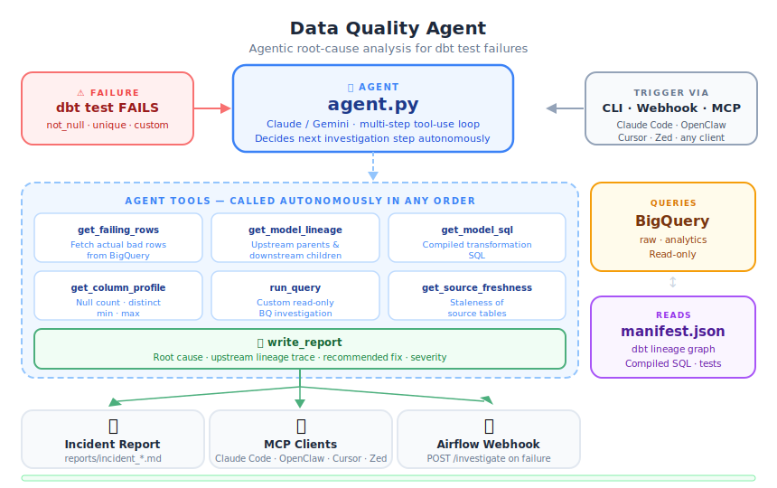

# Data Quality Agent

[](https://github.com/ARAVINDHRAJA123/data-quality-agent/actions/workflows/ci.yml)

An agentic AI system that automatically investigates dbt test failures, traces the root cause through BigQuery lineage, and generates a plain-English incident report — cutting investigation time from hours to minutes.

📄 [Sample incident report](docs/sample_report.md)

---

## Architecture



---

## What it does

When a dbt test fails you normally get a cryptic error message. This agent:

1. **Fetches the failing rows** from BigQuery — sees the actual bad data
2. **Reads the dbt manifest** — understands the full lineage graph
3. **Traces upstream** — profiles columns in parent models and source tables
4. **Identifies the root cause** — finds where the bad data entered the pipeline
5. **Writes an incident report** — plain-English root cause, lineage trace, recommended fix, severity

```
not_null_fct_transactions_merchant failed (23 rows)
        │
        ▼
Agent fetches failing rows → reads fct lineage → traces to int_ → traces to stg_ → checks raw source
        │
        ▼
Root cause: 23 rows in raw.bank_transactions have NULL narration.
Merchant extraction returns NULL when narration is NULL.
Fix: Add COALESCE(narration, '') in stg_bank__transactions.
Severity: HIGH
```

---

## Three trigger modes

### 1 — CLI
```bash
python agent.py \
  --test not_null_fct_transactions_merchant \
  --model fct_transactions \
  --column merchant \
  --verbose
```

### 2 — Webhook (Airflow or any HTTP caller)
```bash
python server.py   # starts on port 5051

curl -X POST http://localhost:5051/investigate \
  -H "Content-Type: application/json" \
  -d '{"test_name": "not_null_fct_transactions_merchant", "model": "fct_transactions", "column": "merchant"}'
```

Point your Airflow DAG's `on_failure_callback` at this endpoint.

### 3 — MCP (any AI client)
The MCP server exposes three tools to any MCP-compatible client — Claude Code, OpenClaw (ChatGPT / Gemini / any client), Cursor, Zed:

| Tool | What it does |
|---|---|
| `investigate_failure` | Full agentic investigation → incident report |
| `list_failures` | List failing tests from run_results.json |
| `get_report` | Read a saved incident report |

**Claude Code:**
```bash
claude mcp add -s user \
  -e GCP_PROJECT=your-project \
  -e BQ_LOCATION=asia-south1 \
  -e DBT_MANIFEST_PATH=/path/to/dbt_bank/target/manifest.json \
  -e DBT_RUN_RESULTS_PATH=/path/to/dbt_bank/target/run_results.json \
  -e GEMINI_API_KEY=your-key \
  dbt-investigator \
  -- /path/to/venv/bin/python /path/to/mcp_server.py
```

**OpenClaw (ChatGPT, Gemini, or any other client):**
```bash
openclaw mcp set dbt-investigator '{
  "command": "/path/to/venv/bin/python",
  "args": ["/path/to/mcp_server.py"],
  "cwd": "/path/to/data-quality-agent",
  "env": {
    "GCP_PROJECT": "your-project",
    "GEMINI_API_KEY": "your-key",
    "DBT_MANIFEST_PATH": "/path/to/manifest.json",
    "DBT_RUN_RESULTS_PATH": "/path/to/run_results.json"
  }
}'
openclaw mcp probe   # → dbt-investigator: 3 tools ✔
```

---

## Agent tools

| Tool | What the agent calls |
|---|---|
| `get_failing_rows` | Queries BigQuery for actual bad rows |
| `get_model_lineage` | Reads manifest.json for upstream/downstream |
| `get_model_sql` | Gets compiled SQL for any model |
| `get_column_profile` | null count, distinct count, min, max |
| `run_query` | Custom read-only BQ investigation |
| `get_source_freshness` | Checks staleness of source tables |
| `write_report` | Writes the final incident report |

**Safety wall:** all BigQuery queries are read-only (SELECT/WITH only). DML/DDL rejected before execution.

---

## Setup

```bash
git clone https://github.com/ARAVINDHRAJA123/data-quality-agent.git
cd data-quality-agent

python3 -m venv venv && source venv/bin/activate
pip install -r requirements.txt

# Auth
gcloud auth application-default login

# Set environment
export GCP_PROJECT=your-project
export BQ_LOCATION=asia-south1
export DBT_MANIFEST_PATH=/path/to/dbt_bank/target/manifest.json
export DBT_RUN_RESULTS_PATH=/path/to/dbt_bank/target/run_results.json

# LLM (pick one)
export GEMINI_API_KEY=your-key      # free
export ANTHROPIC_API_KEY=your-key  # paid
```

Generate the manifest first (from your dbt project):
```bash
cd /path/to/dbt_project && dbt compile
# manifest.json is now at target/manifest.json
```

---

## Stack

- **Claude / Gemini** — LLM provider (auto-detected, free Gemini supported)
- **BigQuery** — data warehouse (GCP)
- **dbt manifest.json** — lineage graph and compiled SQL
- **FastMCP** — MCP server (any AI client)
- **Flask** — webhook server (Airflow integration)
- **pytest** — test suite

---

## Project structure

```
data-quality-agent/
├── agent.py          ← agentic investigation loop (Claude + Gemini)
├── server.py         ← Flask webhook server
├── mcp_server.py     ← FastMCP server (any MCP client)
├── report.py         ← incident report formatter
├── tools/
│   ├── bq_tools.py   ← BigQuery: failing rows, queries, freshness
│   └── dbt_tools.py  ← manifest: lineage, SQL, test results
├── tests/
│   └── test_tools.py ← 11 unit tests (no BQ/LLM needed)
├── reports/          ← saved incident reports (markdown)
└── requirements.txt
```
